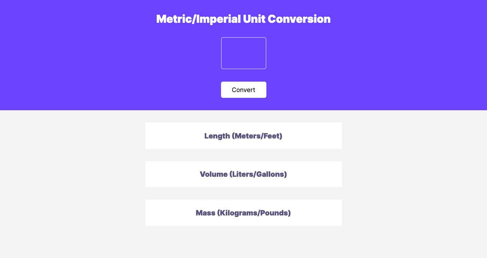
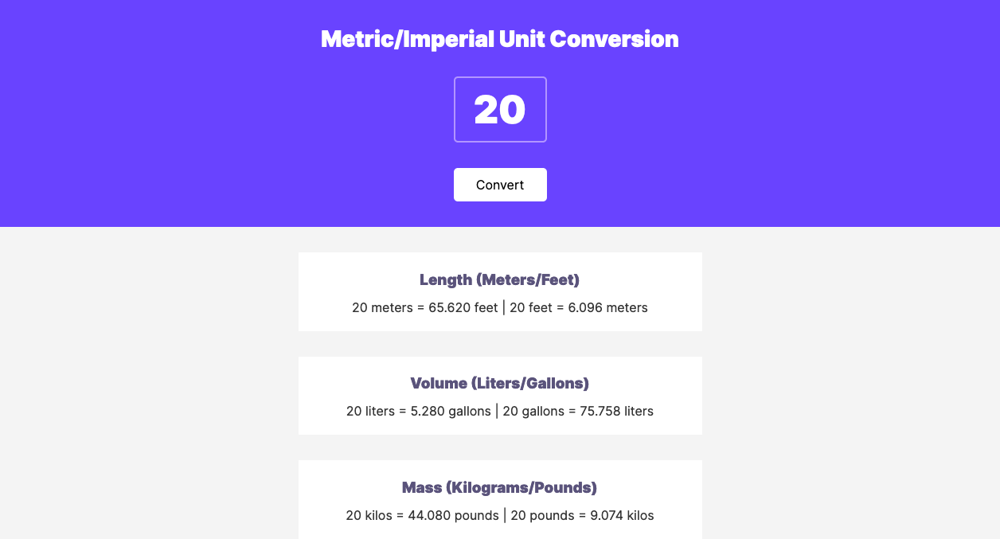
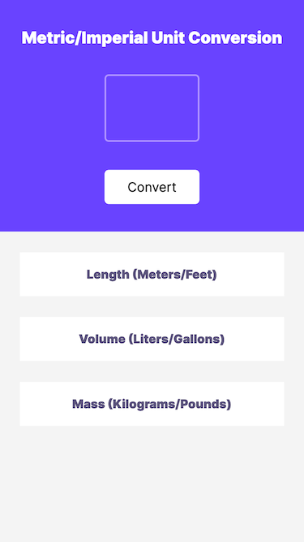
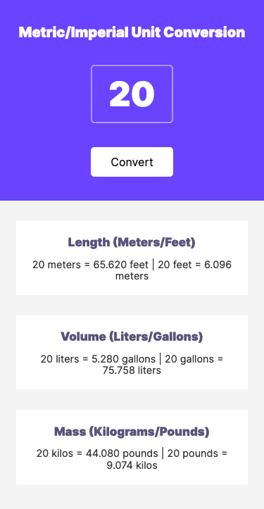

# Unit Converter

A unit converter which takes a numerical input and converts it from Metric to Imperial units. The types of units include: length (meters & feet), volume (liters and gallons), and mass (kilograms and pounds).

## Contents 

- [Overview](#overview)
- [Screenshots](#screenshots)
  - [Desktop](#desktop)
  - [Mobile](#mobile)
- [My Process](#my-process)
  - [A mobile first approach](#a-mobile-first-approach)
  - [Built with](#built-with)
- [Status](#status)
- [Connect](#connect)

## Overview

This is my solo project from [Module 3 of Scrimba's Frontend Career Path](https://scrimba.com/learn/frontend). The requirements of the project include:
- Following the design specfications (as indicated in [the provided Figma file](https://www.figma.com/file/cqtGul0V8RFXY4vTcIv1Kc/Unit-Conversion?node-id=0%3A1))
- Generate all conversions when the button is clicked
- Round numbers to 3 decimal places 

## Screenshots

### Desktop

### Mobile

## My Process

### A mobile first approach

Though a mobile design was not included in the design specfications I chose to beging by desinging the mobile version of the website first before designing the deskop version. I find this approach advantageous because HTML is already responsive on its own (without adding any CSS) and lets you limit the number of media queries needed to adjust the design to larger screens. This is a technique I learned from [Kevin Powell's Conquering Responsive Web Design course](https://courses.kevinpowell.co/conquering-responsive-layouts). For a more detailed description of this technique, you can read about it in the ['My Process' section of the 'Visit Chiang Mai' project](https://github.com/ananfito/visitchiangmai#my-process).

For this project, the minimalistic design lent itself easily to a mobile design. I decided to "shrink" down the original design so that it would fit within the dimensions of a smaller device while maintaining a legible font. 

Once the mobile version was complete it was simply a matter of add a media query with a `min-width` of `550px` to adjust the design for larger screensizes. In this design, it amounted to a couple of lines of code to adjust the font sizes to match the design specs.

Finally, after completing the design of the page itself it was time to add in the JavaScript to perform the unit conversions. This includes adding an event listener for the `convert` button which activates a function to convert the units and render the text on the page.

### Built with

- HTML
- CSS
- JavaScript

## Status

A live version can be viewed at: https://ananfito.github.io/unit-converter.

## Connect

Thank you for reading about this project. If you'd like to connect with me for mentoring, collaboration, or employment opportunities, you can do so via the following links:

- [Email](https://anthonynanfito.com/contact/)
- [LinkedIn](https://linkedin.com/in/anthonynanfito)
- [Portfolio](https://ananfito.github.io)
- [Blog](https://ananfito.hashnode.dev)
